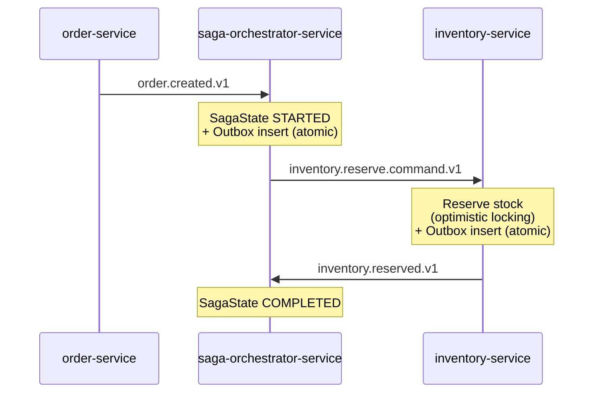

# Order Fulfillment Saga

A distributed order fulfillment system demonstrating **Saga Orchestration** and the **Transactional Outbox Pattern** for maintaining data consistency across independently-owned microservices — without distributed transactions.

## The problem

When a single business operation — placing an order — touches multiple services that each own their own database, how do you keep the system consistent? A classic two-phase commit doesn't scale and couples services at the infrastructure level. This project implements the **Saga pattern** instead: each service performs a local transaction and publishes an event; a central orchestrator coordinates the sequence and reacts to failures.

The **Transactional Outbox Pattern** solves the accompanying problem of *dual writes*: how do you atomically update your database and publish a Kafka event, when a crash between the two would leave them out of sync? Here, the event is written to an `outbox` table in the *same* local transaction as the business data, and a separate scheduled process polls and publishes it — so publishing can never succeed without the business write succeeding too, or vice versa.

## Architecture



Each service owns its database exclusively (**database-per-service**). Cross-service communication happens only through Kafka events — no service ever calls another's API directly or reaches into another's database.

### Services

| Service | Responsibility | Database |
|---|---|---|
| `order-service` | Validates and creates orders | `order_db` |
| `saga-orchestrator-service` | Coordinates the saga, tracks state, drives the next step | `orchestrator_db` |
| `inventory-service` | Reserves stock for an order | `inventory_db` |
| `test-tools` | Standalone Kafka producer for end-to-end testing, independent of `order-service` | — |

### Stack

Java 21 · Spring Boot 4.1.0 · Apache Kafka (KRaft mode) · PostgreSQL · Flyway · Maven multi-module build

## Key design decisions

**Outbox publishing via `@Scheduled` polling, not Debezium/CDC.**
Change Data Capture would remove the polling-latency trade-off, but it also means standing up and operating a CDC pipeline (Debezium + Kafka Connect) for a demo of this scale. Polling every service's outbox is simpler to reason about and sufficient here — the trade-off is a small, bounded publish delay instead of near-real-time delivery.

**Orchestrated saga, not choreographed.**
A choreographed saga (each service reacting to the previous service's event with no central coordinator) avoids a single point of coupling, but scatters the business process across services and makes the overall flow hard to see or debug as steps are added. Centralizing coordination in `saga-orchestrator-service` costs some coupling (the orchestrator has to know every participant) but keeps the process legible and gives one clear place to add compensation logic later.

**Optimistic locking (`@Version`) on `Stock`, not pessimistic row locks.**
Stock reservation is a low-contention write in this domain — optimistic locking avoids holding database locks across the reservation logic and fails fast on genuine conflicts instead.

**`@Retryable` and `@Transactional` kept on separate Spring beans.**
Stacking both annotations on the same method causes proxy-ordering issues where retry can end up wrapping (or being wrapped by) the transaction in the wrong order. Splitting them into distinct beans keeps each concern's proxy behavior predictable.

**No `spring-retry` dependency in `saga-orchestrator-service`.**
YAGNI: there's currently no identified failure mode in the orchestrator that retry would address better than the existing error handling. Added only if a concrete need shows up.

## Known limitations

Deliberately out of scope for this phase, called out explicitly rather than left implicit:

- **No dead-letter queue.** A non-transient failure (e.g. a malformed or unresolvable message) currently exhausts its retry attempts and is either retried indefinitely or silently skipped, depending on the listener's backoff configuration — the message is lost rather than routed somewhere recoverable.
- **`SagaState` transitions directly `STARTED` → `COMPLETED`**, skipping intermediate states like `INVENTORY_RESERVATION_PENDING`. Adequate for the happy path, but too coarse for diagnosing where a saga stalled once compensation and partial-failure handling exist.
- **No compensating transactions yet.** If stock reservation fails, nothing currently unwinds the order. This is the core saga-pattern behavior still to be added.
## Roadmap

- [x] **Phase 0** — Infrastructure and event contracts
- [x] **Phase 1** — `order-service`
- [x] **Phase 2** — `inventory-service` + `saga-orchestrator-service` happy path, validated end-to-end
- [ ] **Phase 3** — Compensating transactions: reject the order and unwind any partial reservation when a step fails
- [ ] **Phase 4** — Idempotency: safely handle redelivered/duplicate Kafka messages
- [ ] **Phase 5** — Resilience: dead-letter topics, retry policy tuning, poison-message handling
- [ ] **Phase 6** — Observability: correlation IDs across services, structured logging, metrics
- [ ] **Phase 7** — API layer for creating orders and querying saga status
- [ ] **Phase 8** — Containerization and CI (per-service Dockerfiles, automated build/test pipeline)
## Running it locally

```bash
docker compose up -d          # Kafka (KRaft), PostgreSQL, Kafka UI on :8090
```

Start each service (from its own directory):

```bash
./mvnw spring-boot:run
```

Publish a test order event and watch the saga run end-to-end:

```bash
cd test-tools
./mvnw compile exec:java -Dexec.mainClass="com.orderfulfillment.testtools.OrderCreatedTestProducer"
```

Check the result:

```sql
SELECT * FROM saga_state ORDER BY created_at DESC LIMIT 1;
-- status should be COMPLETED
```
 